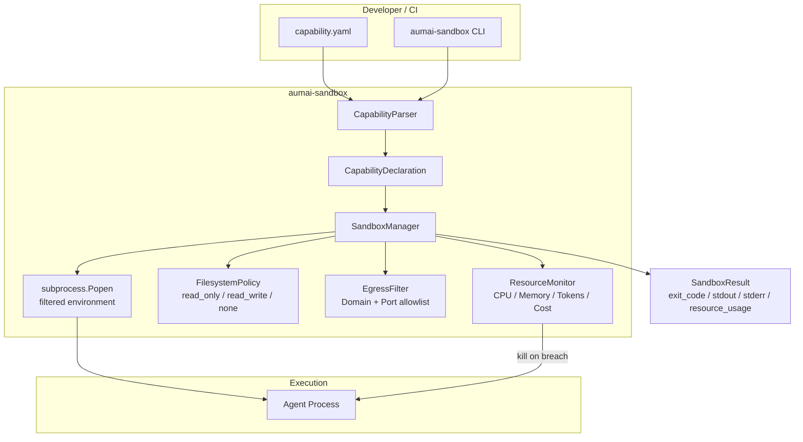

# AumAI Sandbox

> Secure sandboxed execution for AI agents

[](https://github.com/aumai/aumai-sandbox/actions)
[](https://pypi.org/project/aumai-sandbox/)
[](LICENSE)
[](https://python.org)

---

## What is this?

Imagine you hire a contractor to renovate your kitchen. You want them to do the work, but
you do not want them wandering into the rest of your house, copying your personal files, or
running up charges on your credit cards. You give them a key that only opens the kitchen
door, a strict budget, and a time limit. That is exactly what `aumai-sandbox` does for AI
agents.

When an AI agent runs code — browsing the web, calling APIs, executing scripts — it can do
unexpected or dangerous things. `aumai-sandbox` wraps every agent invocation in a
**capability envelope**: a declarative YAML file that says exactly what the agent is
allowed to do. The sandbox enforces memory limits, CPU time caps, cost budgets, token
quotas, filesystem access modes, and network egress rules before a single line of agent
code executes.

**Non-developer analogy:** Think of `aumai-sandbox` as a safety deposit box with a strict
budget enforcer standing next to it. The agent can only reach in, grab what it is allowed
to touch, spend what it is allowed to spend, and connect to the servers it is explicitly
permitted to contact — and nothing else.

---

## Why does this matter?

### The capability explosion problem

AI agents are programs that reason and act autonomously. Giving an agent access to tools
(file I/O, HTTP calls, subprocess execution) is necessary for it to be useful — but the
same capability that lets an agent write a report to `/tmp/output.txt` could let it
exfiltrate data to an external server or spin up hundreds of expensive LLM calls.

Traditional OS-level controls (file permissions, network firewalls) are coarse-grained and
live outside the agent framework. `aumai-sandbox` brings fine-grained, per-agent,
per-invocation policy declarations into the Python layer where developers already live.

### What aumai-sandbox adds

| Without sandbox | With aumai-sandbox |
|---|---|
| Agent may read any env variable | Sensitive keys (`*_SECRET`, `OPENAI_*`, etc.) always stripped |
| No memory cap | Process killed when `max_memory_mb` exceeded |
| No CPU cap | Process killed when `max_cpu_seconds` exceeded |
| No spend cap | LLM cost tracked; execution halted at `max_cost_usd` |
| No token cap | Token usage tracked; execution halted at `max_tokens` |
| Agent can write anywhere | `filesystem_config` restricts paths and modes |
| Agent can call any URL | `network_egress_rules` allowlist outbound destinations |

---

## Architecture



---

## Features

**Capability Declarations** — Define what an agent is allowed to do in a single YAML file.
All fields have safe defaults; you only specify what you want to change.

**Three Isolation Tiers** — `seccomp` (subprocess + filtered environment, portable),
`gvisor` (invokes `runsc run` on Linux), `firecracker` (Firecracker microVM on Linux).

**Hard Resource Limits** — `ResourceMonitor` runs a background polling thread (250 ms
interval) sampling the subprocess via `psutil` and killing the process the moment any
limit is breached: CPU seconds, peak memory, total tokens, or USD cost.

**Environment Variable Filtering** — Sensitive patterns (`*_KEY`, `*_SECRET`, `*_TOKEN`,
`AWS_*`, `OPENAI_*`, `ANTHROPIC_*`, etc.) are always stripped before any subprocess
inherits the environment. An `env_allowlist` can further restrict which variables pass through.

**Filesystem Policy** — Three modes (`read_only`, `read_write`, `none`) enforced by
`FilesystemPolicy`. In `read_write` mode, a `writable_paths` list constrains which
directories can be written to.

**Network Egress Filtering** — `EgressFilter` checks outbound URLs against an allowlist of
domain + port rules. Domain patterns support wildcard prefixes (e.g. `*.example.com`).

**Comprehensive CLI** — Three subcommands: `run`, `validate`, `inspect` with JSON and
human-readable text output formats.

---

## Quick Start

### Install

```bash
pip install aumai-sandbox
```

For accurate CPU/memory metrics, install the optional `psutil` extra:

```bash
pip install "aumai-sandbox[psutil]"
```

### Write a capability file

```yaml
# capability.yaml
sandbox_tier: seccomp

resource_limits:
  max_memory_mb: 256
  max_cpu_seconds: 10.0
  max_cost_usd: 0.05
  max_tokens: 50000

network_egress_rules:
  - domain: "api.openai.com"
    ports: [443]
    rate_limit_per_min: 30

filesystem_config:
  mode: read_only

permissions:
  - read_env

env_allowlist:
  - PATH
  - PYTHONPATH
  - HOME
```

### Validate the capability file

```bash
aumai-sandbox validate --config capability.yaml
```

Output:
```
VALID
  sandbox_tier       : seccomp
  filesystem_mode    : read_only
  max_memory_mb      : 256
  max_cpu_seconds    : 10.0
  max_cost_usd       : 0.05
  max_tokens         : 50000
  egress_rules       : 1
  permissions        : read_env
```

### Run an agent

```bash
aumai-sandbox run --config capability.yaml -- python my_agent.py --task "summarize docs"
```

### Python — first sandbox in 10 lines

```python
from aumai_sandbox import CapabilityDeclaration, ResourceLimits, SandboxManager

manager = SandboxManager()
sandbox_id = manager.create_sandbox(
    CapabilityDeclaration(resource_limits=ResourceLimits(max_cpu_seconds=5.0))
)
result = manager.execute(sandbox_id, ["python", "-c", "print('hello from sandbox')"])
manager.destroy(sandbox_id)

print(result.exit_code)       # 0
print(result.stdout.strip())  # hello from sandbox
print(result.resource_usage)  # {'cpu_seconds': ..., 'peak_memory_mb': ..., ...}
```

---

## CLI Reference

### `aumai-sandbox run`

Run an agent command inside a sandbox defined by a capability YAML file.

```
Usage: aumai-sandbox run [OPTIONS] COMMAND...

Options:
  --config PATH      Path to capability YAML file.  [required]
  --timeout FLOAT    Wall-clock execution timeout in seconds.  [default: 60.0]
  --version          Show version and exit.
  --help             Show this message and exit.
```

**Examples:**

```bash
# Basic run
aumai-sandbox run --config capability.yaml -- python agent.py

# With timeout override
aumai-sandbox run --config capability.yaml --timeout 120 -- python agent.py --verbose

# Node.js agent
aumai-sandbox run --config capability.yaml -- node agent.js

# Arguments with spaces (use -- separator)
aumai-sandbox run --config capability.yaml -- python agent.py --prompt "analyze this text"
```

Stdout and stderr from the agent process are forwarded transparently.
A resource summary is printed to stderr after completion:

```
[sandbox] finished  exit=0  duration=234ms  cpu=0.18s  mem=22.4MiB
```

### `aumai-sandbox validate`

Validate a capability YAML file without running anything. Exits 0 when valid, 1 when not.
Use this in CI to verify capability files before deployment.

```
Usage: aumai-sandbox validate [OPTIONS]

Options:
  --config PATH                Path to capability YAML file.  [required]
  --output [text|json]         Output format.  [default: text]
  --help                       Show this message and exit.
```

**Examples:**

```bash
# Human-readable
aumai-sandbox validate --config capability.yaml

# Machine-readable for CI scripts
aumai-sandbox validate --config capability.yaml --output json
# {"valid": true, "capability": {...}}

# Invalid file produces exit code 1
aumai-sandbox validate --config broken.yaml --output json
# {"valid": false, "error": "capability validation error: ..."}
```

### `aumai-sandbox inspect`

Show status for an active sandbox by ID. Sandboxes are in-process objects; this command
is most useful when invoked programmatically via the Python API.

```
Usage: aumai-sandbox inspect [OPTIONS]

Options:
  --sandbox-id TEXT   Sandbox ID returned by create_sandbox().  [required]
  --help              Show this message and exit.
```

---

## Python API Examples

### Parse a capability from YAML

```python
from aumai_sandbox import CapabilityParser

# From a file
capability = CapabilityParser.from_file("capability.yaml")

# From an inline string
capability = CapabilityParser.from_string("""
sandbox_tier: gvisor
resource_limits:
  max_memory_mb: 512
  max_cpu_seconds: 30.0
""")
```

### Full lifecycle with all options

```python
from aumai_sandbox import (
    CapabilityDeclaration,
    FilesystemConfig,
    FilesystemMode,
    NetworkEgressRule,
    ResourceLimits,
    SandboxManager,
    SandboxTier,
)

capability = CapabilityDeclaration(
    sandbox_tier=SandboxTier.seccomp,
    resource_limits=ResourceLimits(
        max_memory_mb=256,
        max_cpu_seconds=15.0,
        max_cost_usd=0.10,
        max_tokens=100_000,
    ),
    filesystem_config=FilesystemConfig(
        mode=FilesystemMode.read_write,
        writable_paths=["/tmp/agent_scratch"],
    ),
    network_egress_rules=[
        NetworkEgressRule(domain="api.openai.com", ports=[443], rate_limit_per_min=30),
        NetworkEgressRule(domain="*.anthropic.com", ports=[443]),
    ],
    permissions=["read_env"],
    env_allowlist=["PATH", "HOME", "PYTHONPATH"],
)

manager = SandboxManager()
sandbox_id = manager.create_sandbox(capability)

result = manager.execute(
    sandbox_id,
    ["python", "-c", "import sys; print('python:', sys.version.split()[0])"],
    timeout=10.0,
)

print(result.exit_code)           # 0
print(result.stdout.strip())      # python: 3.11.x
print(result.duration_ms)         # 234.5
print(result.resource_usage)      # {'cpu_seconds': 0.18, 'peak_memory_mb': 22.4, ...}

manager.destroy(sandbox_id)
```

### Check network egress rules manually

```python
from aumai_sandbox import EgressFilter, NetworkEgressRule, check_egress

rules = [
    NetworkEgressRule(domain="api.openai.com", ports=[443]),
    NetworkEgressRule(domain="*.anthropic.com", ports=[443]),
]

filt = EgressFilter(rules)
print(filt.is_allowed("https://api.openai.com/v1/chat"))      # True
print(filt.is_allowed("https://evil.com/exfil"))              # False
print(filt.is_allowed("https://api.anthropic.com/v1/msg"))    # True

# Or use the module-level function directly
print(check_egress("https://api.openai.com/v1/chat", rules))  # True
```

### Check filesystem policy manually

```python
from aumai_sandbox import FilesystemConfig, FilesystemMode, FilesystemPolicy, validate_path_access

config = FilesystemConfig(
    mode=FilesystemMode.read_write,
    writable_paths=["/tmp/agent_work"],
)
policy = FilesystemPolicy(config)

print(policy.can_read("/etc/hosts"))                   # True  (reads always allowed in rw)
print(policy.can_write("/etc/hosts"))                  # False (not under writable_paths)
print(policy.can_write("/tmp/agent_work/output.txt"))  # True
print(policy.deny_reason("/etc/hosts", "write"))
# "path '/etc/hosts' is not under any writable_paths (['/tmp/agent_work']); denied write"
```

### Record LLM token/cost usage in the resource monitor

```python
from aumai_sandbox import ResourceLimits
from aumai_sandbox.resources import ResourceMonitor

limits = ResourceLimits(max_tokens=1000, max_cost_usd=0.01)
monitor = ResourceMonitor(limits)
monitor.start()

monitor.record_tokens(350)
monitor.record_cost(0.0035)

ok, reason = monitor.check_limits()
print(ok, reason)  # True None

monitor.record_tokens(800)   # now over 1000 total
ok, reason = monitor.check_limits()
print(ok, reason)  # False "Token limit exceeded: 1150 tokens used, limit is 1000"

monitor.stop()
snapshot = monitor.snapshot()
# {'cpu_seconds': ..., 'peak_memory_mb': 0.0, 'tokens_used': 1150, 'cost_usd': 0.0035, ...}
```

---

## Configuration Options

### `CapabilityDeclaration` fields

| Field | Type | Default | Description |
|---|---|---|---|
| `sandbox_tier` | `SandboxTier` | `seccomp` | Isolation backend |
| `network_egress_rules` | `list[NetworkEgressRule]` | `[]` | Outbound network allowlist; empty = deny all |
| `filesystem_config` | `FilesystemConfig` | `FilesystemConfig()` | Filesystem access policy |
| `resource_limits` | `ResourceLimits` | `ResourceLimits()` | Hard resource caps |
| `permissions` | `list[str]` | `[]` | Named capability tokens (`read_env`, `spawn_subprocess`) |
| `env_allowlist` | `list[str] \| None` | `None` | When set with `read_env`, restricts env vars to this list |

### `ResourceLimits` defaults

| Field | Default | Constraint |
|---|---|---|
| `max_memory_mb` | 512 MiB | ge=1 |
| `max_cpu_seconds` | 30.0 s | gt=0 |
| `max_cost_usd` | $0.10 | gt=0 |
| `max_tokens` | 100,000 | ge=1 |

### `FilesystemConfig` modes

| Mode | Reads | Writes |
|---|---|---|
| `read_only` | All paths | None |
| `read_write` | All paths | Only `writable_paths` (or all paths when list is empty) |
| `none` | None | None |

### `NetworkEgressRule` fields

| Field | Type | Default | Description |
|---|---|---|---|
| `domain` | `str` | required | FQDN or `*.` wildcard prefix |
| `ports` | `list[int]` | `[]` | Allowed TCP/UDP ports; empty = all ports |
| `rate_limit_per_min` | `int` | `60` | Max outbound requests per minute to this domain |

### Sensitive environment variable patterns (always filtered)

```
*_KEY    *_SECRET    *_TOKEN    *_PASSWORD    *_CREDENTIAL
AWS_*    AZURE_*     GCP_*      OPENAI_*      ANTHROPIC_*
```

---

## How it works — Technical Deep-Dive

### Isolation model

`aumai-sandbox` implements the **orchestration layer**, not the kernel layer. It manages
the subprocess lifecycle, enforces policy, and monitors resources. On Linux with gVisor
installed, it delegates kernel isolation to `runsc run`. On other platforms it falls back
to subprocess isolation with environment filtering — which is a useful policy layer even
without kernel-level confinement.

The architecture separates concerns:
1. `CapabilityParser` validates the policy declaration using Pydantic.
2. `SandboxManager` manages the lifecycle: create → execute → destroy.
3. `ResourceMonitor` polls the subprocess via `psutil` every 250 ms and kills it on violation.
4. `FilesystemPolicy` evaluates path access against the declared mode (advisory pre-flight).
5. `EgressFilter` evaluates URLs against domain + port rules (advisory, in-process).

### Resource monitoring

When `psutil` is installed, `ResourceMonitor` samples real CPU time (user + system) and
RSS memory from the subprocess. When it is not available, the background thread still runs
and wall-clock elapsed time is used as a proxy for CPU time in `snapshot()`. Token and cost
counters are updated externally via `record_tokens()` and `record_cost()`.

### Thread safety

`SandboxManager` uses a global lock for the sandbox registry and per-sandbox locks for
state transitions. `ResourceMonitor` uses its own lock for metric counters. Both classes
are safe for concurrent use from multiple threads.

### Command validation

Before launching any subprocess, `_validate_command()` rejects empty commands and checks
`command[0]` (the executable) for shell metacharacters (`;`, `|`, `&`, `$`, `` ` ``,
newline). Known-safe executables (`python`, `python3`, `node`, `bash`, `sh`) pass silently;
unknown executables produce a warning but are not blocked.

---

## Integration with other AumAI projects

- **aumai-connectorguard** — Validate agent-to-tool connections before the agent runs.
  Combine with `aumai-sandbox` to enforce both connection policy and resource limits.
- **aumai-specs** — Use `CapabilityDeclaration` as a formal contract in agent specifications.
- **aumai-registry** — Register sandbox-capable agent types with their default capability
  profiles in a central registry.

---

## Contributing

We welcome contributions. Please read `CONTRIBUTING.md` for the full guide.

Quick steps:

1. Fork the repository.
2. Create a feature branch: `git checkout -b feature/my-change`
3. Install dev dependencies: `pip install -e ".[dev]"`
4. Run the test suite: `pytest`
5. Open a pull request against `main`.

All Python code must pass `ruff` and `mypy --strict`. Tests are required for all new
public APIs.

---

## License

Apache License 2.0 — see `LICENSE` for the full text.

## Part of AumAI

This project is part of [AumAI](https://github.com/aumai) — open source infrastructure
for the agentic AI era.
